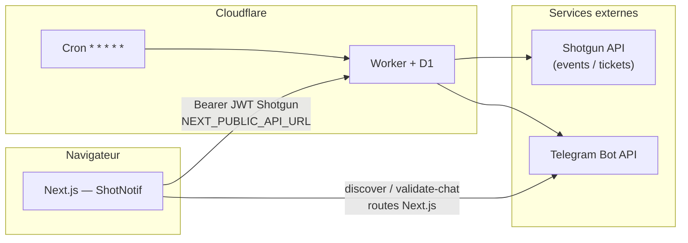

# ShotNotif

**Notifications Telegram en temps quasi réel** pour chaque nouvelle vente comptabilisée sur [Shotgun.live](https://shotgun.live), avec **polling planifié** (Cloudflare Workers + cron), persistance **D1**, et **dashboard Next.js** (configuration bot, éditeur de message TipTap). Le rendu des messages est **partagé** entre le Worker et le front via `@shotgun-notifier/shared`.

| | |
|---|---|
| **Worker (runtime)** | `shotgun-notifier-v3` — `apps/worker/src/index.js` |
| **Monorepo** | npm workspaces (`apps/*`, `packages/*`), Turborepo optionnel |
| **Doc** | README v3 — aligné sur le code au **29 mars 2026** |

---

## Sommaire

1. [Produit & cas d’usage](#1-produit--cas-dusage)
2. [Architecture](#2-architecture)
3. [Structure du dépôt](#3-structure-du-dépôt)
4. [Stack technique](#4-stack-technique)
5. [Modèle de données (D1)](#5-modèle-de-données-d1)
6. [Worker — détail d’implémentation](#6-worker--détail-dimplémentation)
7. [API REST du Worker](#7-api-rest-du-worker)
8. [Package `@shotgun-notifier/shared`](#8-package-shotgun-notifiershared)
9. [Application web (Next.js)](#9-application-web-nextjs)
10. [Internationalisation (i18n)](#10-internationalisation-i18n)
11. [Variables d’environnement](#11-variables-denvironnement)
12. [Installation & développement local](#12-installation--développement-local)
13. [Déploiement production](#13-déploiement-production)
14. [Observabilité](#14-observabilité)
15. [Sécurité & menaces](#15-sécurité--menaces)
16. [Dépannage](#16-dépannage)
17. [Licence](#17-licence)

---

## 1. Produit & cas d’usage

1. L’organisateur ouvre le site, colle son **JWT API Shotgun** (Smartboard — même famille que *Paramètres → Integrations* sur Shotgun).
2. Le **Worker** valide le token contre l’API Shotgun, **upsert** une ligne `organizers` en D1.
3. Un **cron chaque minute** interroge l’API tickets Shotgun, met à jour les compteurs et détecte les **nouveaux** billets aux statuts comptés (`valid`, `resold`).
4. **Premier cycle** : *bootstrap* — import historique (plafonné en pages par événement), **sans** Telegram.
5. **Cycles suivants** : sync incrémental + **une notification Telegram par événement** ayant eu des ventes sur ce run, avec texte issu du **template TipTap** (JSON) + variables métier.

**Contraintes actuelles** : une destination Telegram par organisateur (`telegram_chat_id` unique) ; pas de file multi-canal en prod (WhatsApp / Discord / Messenger sont surtout préparés côté UI).

---

## 2. Architecture



| Flux | Rôle |
|------|------|
| **Auth métier** | Le JWT Shotgun sert d’identité (`organizerId` dans le payload) *et* de secret : toute route protégée vérifie `Bearer === organizers.shotgun_token`. |
| **Routes Next `/api/telegram/*`** | Appellent **uniquement** l’API Telegram (`getMe`, `getUpdates`, `getChat`, etc.) pour le confort du dashboard ; **aucune** persistance métier côté Next. |
| **Config & template** | Le dashboard écrit la vérité sur le Worker (`PUT /api/config`, `PUT /api/template`) ; le client garde aussi un **cache** `localStorage` pour résilience offline. |

---

## 3. Structure du dépôt

```
telegramShotgun/
├── apps/
│   ├── worker/
│   │   ├── wrangler.jsonc          # binding D1, cron, observabilité
│   │   ├── migrations/
│   │   │   ├── 0001_initial.sql    # schéma principal
│   │   │   └── 0002_telegram_chat_display.sql
│   │   └── src/
│   │       ├── index.js            # fetch + scheduled + logique sync
│   │       └── worker_v2.old.js    # historique (KV) — non utilisé en prod
│   └── web/
│       ├── src/
│       │   ├── app/                # App Router Next.js 16
│       │   ├── components/         # dashboard, éditeur, mockups, i18n
│       │   ├── lib/                # api, shotgun, message-template, i18n
│       │   └── locales/            # en.json, fr.json
│       └── package.json
├── packages/
│   └── shared/                     # @shotgun-notifier/shared
│       └── src/
│           ├── message-template.ts # TipTap JSON, variables, rendu
│           └── version.ts
├── package.json                    # workspaces racine
├── turbo.json
└── README.md
```

---

## 4. Stack technique

| Couche | Technologies |
|--------|----------------|
| **Worker** | Cloudflare Workers, **D1**, Cron Triggers, `fetch` vers `api.shotgun.live` + Smartboard + Telegram |
| **Web** | **Next.js 16**, **React 19**, TypeScript, **Tailwind CSS 4**, TipTap 3, UI type shadcn / Base UI |
| **i18n** | `i18next`, `react-i18next` — **en** / **fr**, init SSR-safe puis sync `localStorage` + `navigator` après hydratation |
| **Partagé** | `@shotgun-notifier/shared` — JSON TipTap, `renderMessageTemplateWithData` / `Preview`, normalisation settings |
| **Tooling** | Wrangler 4.x, ESLint, Turborepo (tâches `dev` / `build`) |

---

## 5. Modèle de données (D1)

Migrations dans `apps/worker/migrations/`. Après clonage, adapter **`database_name`** / **`database_id`** dans `wrangler.jsonc` à **votre** base D1.

### `organizers`

| Colonne | Description |
|---------|-------------|
| `id` | `organizer_id` extrait du JWT Shotgun (PK) |
| `shotgun_token` | JWT complet (secret de session API) |
| `telegram_token` | Token bot |
| `telegram_chat_id` | Chat cible |
| `telegram_chat_title` | Libellé affichable (migration `0002`) |
| `telegram_chat_type` | Type Telegram (`private`, `group`, …) |
| `message_template` | JSON TipTap (`doc`) |
| `message_template_settings` | JSON (ex. `showEventNameOnlyWhenMultipleEvents`) |
| `is_active` | `1` = pris en compte par le cron |
| `created_at` / `updated_at` | Horodatage SQLite |

### `sync_state`

| Colonne | Description |
|---------|-------------|
| `organizer_id` | FK → `organizers` |
| `bootstrapped` | `0` → passage bootstrap ; `1` → sync incrémental |
| `cursor` | Curseur tickets Shotgun (`updatedAt_ticketId`) |

### `tickets`

Suivi par billet : `counted` pour savoir si une vente a déjà été notifiée.

### `event_counts` / `deal_counts`

Agrégats vendus par événement et par vague / type de billet.

**Commandes** (depuis `apps/worker`) :

```bash
npm run db:migrate:local    # D1 locale (wrangler dev)
npm run db:migrate:remote   # D1 production
```

---

## 6. Worker — détail d’implémentation

### Constantes notables (`index.js`)

| Constante | Valeur | Rôle |
|-----------|--------|------|
| `VERSION` | `shotgun-notifier-v3` | Health + logs |
| `BOOTSTRAP_MAX_PAGES` | `200` | Plafond de pages tickets **par événement** au bootstrap |
| `SYNC_MAX_PAGES_PER_RUN` | `10` | Pages tickets max **par événement** par minute de cron |
| `COUNTED_STATUSES` | `valid`, `resold` | Statuts Shotgun pris en compte pour les ventes |

### APIs Shotgun utilisées

- **Liste événements** : `GET https://smartboard-api.shotgun.live/api/shotgun/organizers/{id}/events?key={token}` (auth login + métadonnées deals).
- **Tickets** : `GET https://api.shotgun.live/tickets` avec `organizer_id`, `event_id`, `include_cohosted_events`, pagination `after`.

### Telegram

- `POST https://api.telegram.org/bot{token}/sendMessage` avec `disable_web_page_preview: true`.
- Si `telegram_token` ou `telegram_chat_id` vide → sync silencieux (pas d’envoi).

### Rendu message

- `renderMessageTemplateWithData` depuis `@shotgun-notifier/shared`.
- Si le rendu est vide → fallback texte minimal incl. **`Nouvelle vente ShotNotif`** + lignes synthétiques.

### Cron

Déclaré dans `wrangler.jsonc` : `"crons": ["* * * * *"]` (chaque minute). Handler : `scheduled` → `runCron(env.DB)`.

---

## 7. API REST du Worker

**Base URL** : URL de déploiement Worker (HTTPS).

**CORS** : `Access-Control-Allow-Origin: *` ; méthodes `GET, POST, PUT, DELETE, OPTIONS` ; en-têtes `Content-Type, Authorization`.

| Méthode | Chemin | Auth | Description |
|---------|--------|------|-------------|
| `GET` | `/` ou `/health` | Non | `{ ok: true, version }` |
| `OPTIONS` | `*` | Non | Préflight CORS |
| `POST` | `/api/auth` | Non | Body `{ "token": "<JWT Shotgun>" }` — valide Shotgun, upsert `organizers` |
| `GET` | `/api/config` | Bearer | Lit config Telegram + template + settings + `telegramChatTitle` / `Type` |
| `PUT` | `/api/config` | Bearer | Met à jour champs partiels (`telegramToken`, `telegramChatId`, `telegramChatTitle`, `telegramChatType`, optionnellement template) |
| `GET` | `/api/template` | Bearer | Template TipTap normalisé + settings |
| `PUT` | `/api/template` | Bearer | Met à jour `messageTemplate` / `messageTemplateSettings` |
| `DELETE` | `/api/account` | Bearer | Supprime l’organisateur et données associées (batch SQL) |

**Auth** : `Authorization: Bearer <JWT>` doit **exactement** égaler `organizers.shotgun_token` pour l’`organizerId` dérivé du JWT.

---

## 8. Package `@shotgun-notifier/shared`

Runtime **sans dépendance lourde** (Worker + navigateur) :

- Types et métadonnées des **sections** / **variables** de template.
- `DEFAULT_MESSAGE_TEMPLATE_CONTENT`, `MESSAGE_TEMPLATE_PRESETS`, `SAMPLE_MESSAGE_TEMPLATE_CONTEXT`.
- `renderMessageTemplatePreview` (UI), `renderMessageTemplateWithData` (Worker), `serializeMessageTemplate`, `extractMessageTemplateVariableKeys`.
- `normalizeMessageTemplateSettings`, `createMessageTemplateVariableNode` (label override pour i18n côté web).

`VERSION` exportée depuis `packages/shared/src/version.ts` (alignée conceptuellement sur le Worker).

---

## 9. Application web (Next.js)

### Routes App Router

| Route | Composant / rôle |
|-------|------------------|
| `/` | Landing + login JWT Shotgun → `apiLogin` → `localStorage` + cookie `sg_token` |
| `/dashboard` | Config Telegram, guide BotFather, éditeur TipTap, preview Telegram |
| `/dashboard/setup` | Redirige vers `/dashboard` |

### Routes API Next (Edge/Node selon build)

| Route | Rôle |
|-------|------|
| `POST /api/telegram/discover` | `getMe` + `getUpdates` — liste chats récents ; erreur **409** si webhook actif |
| `POST /api/telegram/validate-chat` | Vérifie que le bot peut parler au `chat_id` |

Réponses structurées avec `error` + `errorKey` pour l’i18n côté client (`telegram.subtitle.*`, `errors.telegram.*`).

### Client stockage (`localStorage`)

| Clé | Usage |
|-----|--------|
| `sg_token` | JWT Shotgun (+ cookie miroir `SameSite=Lax`) |
| `tg_token`, `tg_chat_id`, `tg_chat_title`, `tg_chat_type` | Cache config Telegram |
| `message_template`, `message_template_settings` | Cache éditeur |
| `shotgun-notifier-locale` | Préférence **en** / **fr** (i18n) |

### Éditeur & sync

- Modifications template : sauvegarde **immédiate** locale + **debounce ~1,5 s** vers `PUT /api/template`.
- Composant **`SyncIndicator`** : états idle / pending / syncing / synced / error + retry.

---

## 10. Internationalisation (i18n)

- Langues : **anglais** et **français**.
- Fichiers : `apps/web/src/locales/en.json`, `fr.json`.
- **Hydratation** : `i18n` est initialisé en **`lng: "en"`** de façon déterministe ; `AppI18nProvider` applique la langue persistée / navigateur dans un **`useLayoutEffect`** après hydratation, puis persiste sur `languageChanged`.
- Marque produit affichée : **ShotNotif** (mockups BotFather restent en **anglais** pour éviter débordement UI).

---

## 11. Variables d’environnement

### `apps/web`

| Variable | Obligatoire prod | Description |
|----------|------------------|-------------|
| `NEXT_PUBLIC_API_URL` | **Oui** | URL du Worker **sans** slash final (ex. `https://notifshotgun.<subdomain>.workers.dev`). Sinon fallback placeholder dans `src/lib/api.ts` — **à remplacer**. |

### `apps/worker`

La logique **v3** lit tokens Telegram, chat_id et templates depuis **D1**, pas depuis des secrets Wrangler pour le cron. Les secrets globaux type `TELEGRAM_*` / `SG_TOKEN` relèvent d’**anciens** déploiements (cf. `worker_v2.old.js`).

---

## 12. Installation & développement local

### Prérequis

- **Node.js** LTS récent  
- Compte **Cloudflare** (Workers + D1)  
- Token **Shotgun** + bot **Telegram**

### Installation

```bash
npm install
```

### Worker + D1 locale

```bash
cd apps/worker
npm run db:migrate:local
npx wrangler dev
```

Noter l’URL HTTPS locale affichée par Wrangler.

### Next.js

```bash
cd apps/web
# Windows PowerShell exemple :
$env:NEXT_PUBLIC_API_URL="http://127.0.0.1:8787"
npm run dev
```

### Turbo (racine)

```bash
npx turbo dev
```

### Tester le cron en local

```bash
cd apps/worker
npx wrangler dev --test-scheduled
```

### Qualité

```bash
cd apps/web && npm run lint
cd apps/worker && npx wrangler deploy --dry-run   # optionnel
```

---

## 13. Déploiement production

### Worker

1. Vérifier `wrangler.jsonc` (**nom Worker**, **binding D1**, `database_id` réel).
2. Appliquer les migrations **remote** si le schéma a changé :

```bash
cd apps/worker
npm run db:migrate:remote
npx wrangler deploy
```

### Site Next.js

```bash
cd apps/web
npm run build
```

Déployer sur **Vercel**, **Cloudflare Pages**, etc. Définir **`NEXT_PUBLIC_API_URL`** vers l’URL **HTTPS** du Worker.

### Checklist post-déploiement

- [ ] `GET /health` retourne `version: shotgun-notifier-v3`
- [ ] Login dashboard OK (CORS + URL API)
- [ ] Cron visible dans le dashboard Cloudflare (Triggers)
- [ ] D1 : ligne `organizers` mise à jour après sauvegarde dashboard

---

## 14. Observabilité

`wrangler.jsonc` active **observabilité** (logs, sampling). Utiliser le dashboard Cloudflare Workers pour :

- erreurs `fetch` Shotgun / Telegram ;
- durées d’exécution du cron ;
- logs `[shotgun-notifier-v3]`.

---

## 15. Sécurité & menaces

| Sujet | Recommandation |
|-------|----------------|
| **JWT en localStorage + cookie** | XSS sur le domaine du front = vol de session API ; CSP, pas de HTML injecté, HTTPS strict. |
| **Tokens Telegram en D1** | Accès D1 = accès aux bots ; restreindre comptes CF, audit logs. |
| **CORS `*`** | Surface publique assumée ; toute action sensible exige Bearer valide. |
| **Pas de rate limit dans ce repo** | À ajouter en périphérie (Cloudflare WAF / rate limiting) si exposition large. |

---

## 16. Dépannage

| Symptôme | Piste |
|----------|--------|
| Hydratation React / texte EN puis FR | Comportement attendu après fix i18n (premier paint EN, puis locale) ; ou extension navigateur modifiant le DOM |
| Login « token invalide » | `NEXT_PUBLIC_API_URL` incorrect, Worker down, JWT refusé par Shotgun (`401/403` sur liste événements) |
| Aucune notif Telegram | Champs vides en D1, bot retiré du chat, ou **webhook Telegram** déjà défini → `getUpdates` vide (erreur 409 côté discover) |
| Liste chats vide | Envoyer un message au bot / dans le groupe puis relancer **Détecter mes chats** |
| Template cassé | Worker retombe sur défaut + fallback texte ; inspecter `GET /api/template` |
| Bootstrap long | Normal si beaucoup d’historique ; plafond `BOOTSTRAP_MAX_PAGES` |

---

## 17. Licence

MIT

---

*ShotNotif est un outil d’intégration : le nom **Shotgun** / **Shotgun.live** désigne la plateforme tierce ; ce dépôt n’est pas affilié officiellement à Shotgun.*
