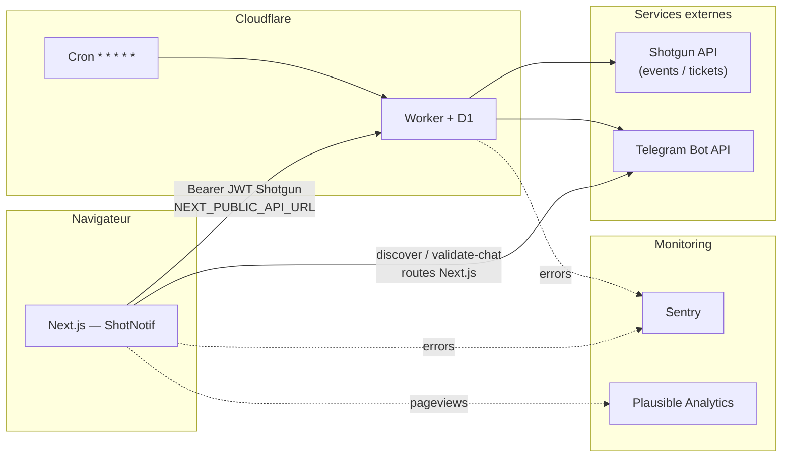

# ShotNotif

**Notifications Telegram en temps quasi réel** pour chaque nouvelle vente comptabilisée sur [Shotgun.live](https://shotgun.live), avec **polling planifié** (Cloudflare Workers + cron), persistance **D1**, **dashboard Next.js** (configuration bot, éditeur de message TipTap), et **vidéo promotionnelle** générée via Remotion. Le rendu des messages est **partagé** entre le Worker et le front via `@shotgun-notifier/shared`.

| | |
|---|---|
| **Worker (runtime)** | `notifshotgun` — `apps/worker/src/index.js` |
| **Monorepo** | npm workspaces (`apps/*`, `packages/*`), Turborepo optionnel |
| **Apps** | Worker (Cloudflare), Web (Next.js 16), Promo-video (Remotion) |
| **Doc** | README v4 — aligné sur le code au **4 avril 2026** |

---

## Sommaire

1. [Produit & cas d’usage](#1-produit--cas-dusage)
2. [Architecture](#2-architecture)
3. [Structure du dépôt](#3-structure-du-dépôt)
4. [Stack technique](#4-stack-technique)
5. [Modèle de données (D1)](#5-modèle-de-données-d1)
6. [Worker — détail d’implémentation](#6-worker--détail-dimplémentation)
7. [API REST du Worker](#7-api-rest-du-worker)
8. [Package `@shotgun-notifier/shared`](#8-package-shotgun-notifiershared)
9. [Application web (Next.js)](#9-application-web-nextjs)
10. [Vidéo promotionnelle (Remotion)](#10-vidéo-promotionnelle-remotion)
11. [Internationalisation (i18n)](#11-internationalisation-i18n)
12. [Variables d’environnement](#12-variables-denvironnement)
13. [Tests](#13-tests)
14. [Installation & développement local](#14-installation--développement-local)
15. [Déploiement production](#15-déploiement-production)
16. [Observabilité & monitoring](#16-observabilité--monitoring)
17. [Sécurité & menaces](#17-sécurité--menaces)
18. [Dépannage](#18-dépannage)
19. [Licence](#19-licence)

---

## 1. Produit & cas d’usage

1. L’organisateur ouvre le site, colle son **JWT API Shotgun** (Smartboard — même famille que *Paramètres → Integrations* sur Shotgun).
2. Le **Worker** valide le token contre l’API Shotgun, **upsert** une ligne `organizers` en D1.
3. Un **cron configurable** (1 min par défaut, jusqu’à hebdomadaire) interroge l’API tickets Shotgun, met à jour les compteurs et détecte les **nouveaux** billets aux statuts comptés (`valid`, `resold`).
4. **Premier cycle** : *bootstrap* — import historique (plafonné en pages par événement), **sans** Telegram.
5. **Cycles suivants** : sync incrémental + **une notification Telegram par événement** ayant eu des ventes sur ce run, avec texte issu du **template TipTap** (JSON) + variables métier.
6. L’organisateur peut configurer la **fréquence de vérification** (`check_interval`), activer le mode **"poster au nom du canal"** (`send_as_chat`), et envoyer du **feedback** directement depuis le dashboard.

**Contraintes actuelles** : une destination Telegram par organisateur (`telegram_chat_id` unique) ; pas de file multi-canal en prod (WhatsApp / Discord / Messenger sont surtout préparés côté UI).

---

## 2. Architecture



| Flux | Rôle |
|------|------|
| **Auth métier** | Le JWT Shotgun sert d’identité (`organizerId` dans le payload) *et* de secret : toute route protégée vérifie `Bearer === organizers.shotgun_token`. |
| **Routes Next `/api/telegram/*`** | Appellent **uniquement** l’API Telegram (`getMe`, `getUpdates`, `getChat`, etc.) pour le confort du dashboard ; **aucune** persistance métier côté Next. |
| **Config & template** | Le dashboard écrit la vérité sur le Worker (`PUT /api/config`, `PUT /api/template`) ; le client garde aussi un **cache** `localStorage` pour résilience offline. |
| **Monitoring** | **Sentry** capture les erreurs côté front (Next.js) et back (Worker). **Plausible** suit les analytics côté front (privacy-friendly, sans cookies). |

---

## 3. Structure du dépôt

```
telegramShotgun/
├── apps/
│   ├── worker/                         # Cloudflare Worker (cron + API REST)
│   │   ├── wrangler.jsonc              # binding D1, cron, observabilité
│   │   ├── migrations/
│   │   │   ├── 0001_initial.sql        # schéma principal
│   │   │   ├── 0002_telegram_chat_display.sql
│   │   │   ├── 0003_telegram_send_as_chat.sql
│   │   │   ├── 0004_check_interval.sql
│   │   │   ├── 0005_rate_limits.sql
│   │   │   └── 0006_cron_index.sql
│   │   └── src/
│   │       ├── index.js                # fetch + scheduled + logique sync
│   │       ├── helpers.js              # fonctions pures extraites (testables)
│   │       └── helpers.test.js         # tests unitaires (Vitest)
│   ├── web/                            # Dashboard Next.js 16
│   │   ├── sentry.server.config.ts     # Sentry serveur
│   │   ├── sentry.edge.config.ts       # Sentry edge
│   │   └── src/
│   │       ├── app/
│   │       │   ├── error.tsx           # page erreur 500 (i18n + retry)
│   │       │   ├── global-error.tsx    # erreur globale (fallback sans providers)
│   │       │   ├── not-found.tsx       # 404 → redirect /dashboard
│   │       │   ├── opengraph-image.tsx # OG image dynamique (edge, 1200x630)
│   │       │   └── twitter-image.tsx   # Twitter Card (re-export OG)
│   │       ├── components/             # dashboard, éditeur, mockups, feedback, i18n
│   │       ├── instrumentation.ts      # Sentry serveur/edge init
│   │       ├── instrumentation-client.ts # Sentry client init (Turbopack-compatible)
│   │       ├── lib/                    # api, shotgun, message-template, i18n
│   │       └── locales/                # en.json, fr.json
│   └── promo-video/                    # Vidéo promotionnelle (Remotion)
│       ├── remotion.config.ts
│       └── src/
│           ├── Root.tsx                # point d'entrée Remotion
│           └── promo/
│               ├── ShotNotifPromo.tsx  # composition principale
│               ├── constants.ts        # FPS, résolution, couleurs
│               ├── copy.ts             # textes de la vidéo
│               ├── scenes/             # Demo, Editor, Outro
│               ├── mockups/            # mockups dashboard animés
│               └── ui.tsx              # composants UI réutilisables
├── packages/
│   └── shared/                         # @shotgun-notifier/shared
│       └── src/
│           ├── message-template.ts     # TipTap JSON, variables, rendu
│           └── version.ts
├── package.json                        # workspaces racine
├── turbo.json
└── README.md
```

---

## 4. Stack technique

| Couche | Technologies |
|--------|----------------|
| **Worker** | Cloudflare Workers, **D1** (SQLite), Cron Triggers, `fetch` vers `api.shotgun.live` + Smartboard + Telegram |
| **Web** | **Next.js 16** (Turbopack), **React 19**, TypeScript, **Tailwind CSS 4**, TipTap 3, UI type shadcn / Base UI |
| **Promo-video** | **Remotion 4**, React 18, Tailwind CSS 3, Lucide React — rendu MP4 1080x1920 @ 30fps |
| **i18n** | `i18next`, `react-i18next` — **en** / **fr**, init SSR-safe puis sync `localStorage` + `navigator` après hydratation |
| **Partagé** | `@shotgun-notifier/shared` — JSON TipTap, `renderMessageTemplateWithData` / `Preview`, normalisation settings |
| **Monitoring** | **Sentry** (`@sentry/nextjs` + `@sentry/cloudflare`) — error tracking front + back |
| **Analytics** | **Plausible** (`next-plausible`) — analytics privacy-friendly, sans cookies |
| **Tests** | **Vitest** — tests unitaires des helpers Worker |
| **Tooling** | Wrangler 4.x, ESLint, Turborepo (tâches `dev` / `build`) |

---

## 5. Modèle de données (D1)

Migrations dans `apps/worker/migrations/`. Après clonage, adapter **`database_name`** / **`database_id`** dans `wrangler.jsonc` à **votre** base D1.

### `organizers`

| Colonne | Description |
|---------|-------------|
| `id` | `organizer_id` extrait du JWT Shotgun (PK) |
| `shotgun_token` | JWT complet (secret de session API) |
| `telegram_token` | Token bot |
| `telegram_chat_id` | Chat cible |
| `telegram_chat_title` | Libellé affichable (migration `0002`) |
| `telegram_chat_type` | Type Telegram (`private`, `group`, `channel`, …) |
| `telegram_send_as_chat` | `1` = poster au nom du canal (migration `0003`) |
| `message_template` | JSON TipTap (`doc`) |
| `message_template_settings` | JSON (ex. `showEventNameOnlyWhenMultipleEvents`) |
| `check_interval` | Fréquence de vérification en minutes (migration `0004`, défaut `1`) |
| `last_checked_at` | Timestamp du dernier check cron réussi |
| `is_active` | `1` = pris en compte par le cron |
| `created_at` / `updated_at` | Horodatage SQLite |

### `sync_state`

| Colonne | Description |
|---------|-------------|
| `organizer_id` | FK → `organizers` |
| `bootstrapped` | `0` → passage bootstrap ; `1` → sync incrémental |
| `cursor` | Curseur tickets Shotgun (`updatedAt_ticketId`) |

### `tickets`

Suivi par billet : `counted` pour savoir si une vente a déjà été notifiée.

### `event_counts` / `deal_counts`

Agrégats vendus par événement et par vague / type de billet.

### `rate_limits`

Sliding window rate limiting par IP + endpoint (migration `0005`).

### Index

- `idx_organizers_cron` sur `(is_active, last_checked_at)` — optimise la requête cron (migration `0006`).

**Commandes** (depuis `apps/worker`) :

```bash
npm run db:migrate:local    # D1 locale (wrangler dev)
npm run db:migrate:remote   # D1 production
```

---

## 6. Worker — détail d’implémentation

### Organisation du code

Le code Worker est séparé en deux fichiers :

- **`index.js`** — logique principale : handlers `fetch` / `scheduled`, sync Shotgun, envoi Telegram, CORS, rate limiting.
- **`helpers.js`** — fonctions pures extraites pour testabilité : parsing, validation, construction d'URLs, formatage de données de notification.

### Constantes notables (`index.js`)

| Constante | Valeur | Rôle |
|-----------|--------|------|
| `VERSION` | `shotgun-notifier-v3` | Health + logs |
| `BOOTSTRAP_MAX_PAGES` | `200` | Plafond de pages tickets **par événement** au bootstrap |
| `SYNC_MAX_PAGES_PER_RUN` | `10` | Pages tickets max **par événement** par minute de cron |
| `COUNTED_STATUSES` | `valid`, `resold` | Statuts Shotgun pris en compte pour les ventes |
| `CHECK_INTERVAL_OPTIONS` | `1, 5, 10, 60, 300, 720, 1440, 10080` | Intervalles de check autorisés (minutes) |

### APIs Shotgun utilisées

- **Liste événements** : `GET https://smartboard-api.shotgun.live/api/shotgun/organizers/{id}/events?key={token}` (auth login + métadonnées deals).
- **Tickets** : `GET https://api.shotgun.live/tickets` avec `organizer_id`, `event_id`, `include_cohosted_events`, pagination `after`.

### Telegram

- `POST https://api.telegram.org/bot{token}/sendMessage` avec `disable_web_page_preview: true`.
- Si `telegram_token` ou `telegram_chat_id` vide → sync silencieux (pas d’envoi).

### Rendu message

- `renderMessageTemplateWithData` depuis `@shotgun-notifier/shared`.
- Si le rendu est vide → fallback texte minimal incl. **`Nouvelle vente ShotNotif`** + lignes synthétiques.

### Cron

Déclaré dans `wrangler.jsonc` : `"crons": ["* * * * *"]` (chaque minute). Handler : `scheduled` → `runCron(env.DB)`.

Le cron respecte le `check_interval` par organisateur : seuls les organisateurs dont le dernier check date de plus de `check_interval` minutes sont traités. L'index `idx_organizers_cron` optimise cette requête.

### CORS multi-origin

Le Worker supporte plusieurs origines via la variable d'environnement `ALLOWED_ORIGINS` (virgule-séparée). L'en-tête `Access-Control-Allow-Origin` retourne l'origine matchée (pas `*`). Défaut : `https://shotnotif.vercel.app`.

### Rate limiting

Rate limiting par sliding window (IP + endpoint) stocké en table D1 `rate_limits`. Protège les endpoints sensibles contre les abus.

### Sentry (Worker)

Le Worker est wrappé avec `Sentry.withSentry()` de `@sentry/cloudflare`. Les erreurs non capturées sont envoyées automatiquement à Sentry avec le contexte Cloudflare.

---

## 7. API REST du Worker

**Base URL** : URL de déploiement Worker (HTTPS).

**CORS** : `Access-Control-Allow-Origin: <matched origin>` (multi-origin via `ALLOWED_ORIGINS`) ; méthodes `GET, POST, PUT, DELETE, OPTIONS` ; en-têtes `Content-Type, Authorization`.

| Méthode | Chemin | Auth | Description |
|---------|--------|------|-------------|
| `GET` | `/` ou `/health` | Non | `{ ok: true, version }` |
| `OPTIONS` | `*` | Non | Préflight CORS |
| `POST` | `/api/auth` | Non | Body `{ "token": "<JWT Shotgun>" }` — valide Shotgun, upsert `organizers` |
| `GET` | `/api/config` | Bearer | Lit config Telegram + template + settings + `telegramChatTitle` / `Type` |
| `PUT` | `/api/config` | Bearer | Met à jour champs partiels (`telegramToken`, `telegramChatId`, `telegramChatTitle`, `telegramChatType`, optionnellement template) |
| `GET` | `/api/template` | Bearer | Template TipTap normalisé + settings |
| `PUT` | `/api/template` | Bearer | Met à jour `messageTemplate` / `messageTemplateSettings` |
| `DELETE` | `/api/account` | Bearer | Supprime l’organisateur et données associées (batch SQL) |

**Auth** : `Authorization: Bearer <JWT>` doit **exactement** égaler `organizers.shotgun_token` pour l’`organizerId` dérivé du JWT.

---

## 8. Package `@shotgun-notifier/shared`

Runtime **sans dépendance lourde** (Worker + navigateur) :

- Types et métadonnées des **sections** / **variables** de template.
- `DEFAULT_MESSAGE_TEMPLATE_CONTENT`, `MESSAGE_TEMPLATE_PRESETS`, `SAMPLE_MESSAGE_TEMPLATE_CONTEXT`.
- `renderMessageTemplatePreview` (UI), `renderMessageTemplateWithData` (Worker), `serializeMessageTemplate`, `extractMessageTemplateVariableKeys`.
- `normalizeMessageTemplateSettings`, `createMessageTemplateVariableNode` (label override pour i18n côté web).

`VERSION` exportée depuis `packages/shared/src/version.ts` (alignée conceptuellement sur le Worker).

---

## 9. Application web (Next.js)

### Routes App Router

| Route | Composant / rôle |
|-------|------------------|
| `/` | Landing + login JWT Shotgun → `apiLogin` → `localStorage` + cookie `sg_token` |
| `/dashboard` | Config Telegram, guide BotFather, éditeur TipTap, preview Telegram, feedback |
| `/dashboard/setup` | Redirige vers `/dashboard` |
| `404` | `not-found.tsx` — redirige automatiquement vers `/dashboard` |
| `500` | `error.tsx` — page d’erreur i18n avec bouton retry |
| `global-error` | `global-error.tsx` — fallback sans providers (erreur critique) |

### Routes API Next (Edge/Node selon build)

| Route | Rôle |
|-------|------|
| `POST /api/telegram/discover` | `getMe` + `getUpdates` — liste chats récents ; erreur **409** si webhook actif |
| `POST /api/telegram/validate-chat` | Vérifie que le bot peut parler au `chat_id` |

Réponses structurées avec `error` + `errorKey` pour l’i18n côté client (`telegram.subtitle.*`, `errors.telegram.*`). Les messages d’erreur techniques ne sont **jamais** exposés au client en production.

### SEO & Open Graph

- **Métadonnées** globales définies dans `layout.tsx` (`title`, `description`, `openGraph`, `twitter`, `robots`).
- **Image OG dynamique** (`opengraph-image.tsx`) : générée à la volée en edge runtime (1200x630), réutilisée pour Twitter Card (`twitter-image.tsx`).
- Le dashboard est exclu de l’indexation (`robots: { index: false }`).

### Sentry (Frontend)

- **Client** : initialisé dans `instrumentation-client.ts` (compatible Turbopack) avec Session Replay sur erreur.
- **Serveur / Edge** : initialisé via `instrumentation.ts` → `sentry.server.config.ts` / `sentry.edge.config.ts`.
- `onRequestError` capture les erreurs de requêtes avec le contexte de la route (kind, path, type).
- Source maps uploadées automatiquement en CI via `withSentryConfig` dans `next.config.ts`.

### Plausible Analytics

Analytics privacy-friendly (sans cookies, RGPD-compliant) via `next-plausible`. Le composant `<PlausibleProvider>` dans `layout.tsx` gère automatiquement le tracking SPA (changements de route App Router).

### Feedback

Composant `FeedbackSection` intégré au dashboard : l’utilisateur peut signaler un bug ou proposer une feature avec un message et un email optionnel. Envoyé au Worker via `POST /api/feedback`.

### Client stockage (`localStorage`)

| Clé | Usage |
|-----|--------|
| `sg_token` | JWT Shotgun (+ cookie miroir `SameSite=Lax`) |
| `tg_token`, `tg_chat_id`, `tg_chat_title`, `tg_chat_type` | Cache config Telegram |
| `message_template`, `message_template_settings` | Cache éditeur |
| `shotgun-notifier-locale` | Préférence **en** / **fr** (i18n) |

### Éditeur & sync

- Modifications template : sauvegarde **immédiate** locale + **debounce ~1,5 s** vers `PUT /api/template`.
- Composant **`SyncIndicator`** : états idle / pending / syncing / synced / error + retry.

---

## 10. Vidéo promotionnelle (Remotion)

L'app `apps/promo-video` génère une vidéo de présentation ShotNotif en **MP4 vertical** (1080x1920 @ 30fps) avec **Remotion 4**.

### Composition

| Scène | Description |
|-------|-------------|
| **Demo** | Démonstration visuelle du produit avec mockups dashboard animés |
| **Editor** | Mise en avant de l'éditeur de template TipTap |
| **Outro** | Call-to-action final |

### Scripts

```bash
cd apps/promo-video
npm run dev       # Remotion Studio (prévisualisation live)
npm run render    # Rendu MP4 → out/shotnotif-promo.mp4
npm run still     # Export poster PNG (frame 420)
```

### Stack

- **Remotion 4** + **React 18** + **Tailwind CSS 3** (via `@remotion/tailwind`)
- **Lucide React** pour les icônes
- Design system custom avec palette de couleurs cohérente (Telegram blue, Shotgun orange, emerald, rose)

---

## 11. Internationalisation (i18n)

- Langues : **anglais** et **français**.
- Fichiers : `apps/web/src/locales/en.json`, `fr.json`.
- **Hydratation** : `i18n` est initialisé en **`lng: "en"`** de façon déterministe ; `AppI18nProvider` applique la langue persistée / navigateur dans un **`useLayoutEffect`** après hydratation, puis persiste sur `languageChanged`.
- Marque produit affichée : **ShotNotif** (mockups BotFather restent en **anglais** pour éviter débordement UI).

---

## 12. Variables d’environnement

### `apps/web`

| Variable | Obligatoire prod | Description |
|----------|------------------|-------------|
| `NEXT_PUBLIC_API_URL` | **Oui** | URL du Worker **sans** slash final (ex. `https://notifshotgun.<subdomain>.workers.dev`) |
| `SENTRY_DSN` | **Oui** | DSN Sentry serveur (côté build + SSR) |
| `SENTRY_AUTH_TOKEN` | **Oui** | Token Sentry pour l’upload des source maps (CI/build) |

> Le DSN Sentry client est hardcodé dans `instrumentation-client.ts` (public par design).
> Plausible est configuré via le `src` prop de `<PlausibleProvider>` dans `layout.tsx`.

### `apps/worker`

| Variable | Obligatoire prod | Description |
|----------|------------------|-------------|
| `ALLOWED_ORIGINS` | Non | Origines CORS autorisées, virgule-séparées (défaut : `https://shotnotif.vercel.app`) |

La logique **v3** lit tokens Telegram, chat_id et templates depuis **D1**, pas depuis des secrets Wrangler pour le cron. Le DSN Sentry Worker est hardcodé dans `index.js`.

---

## 13. Tests

### Worker — tests unitaires (Vitest)

Les fonctions pures du Worker sont extraites dans `helpers.js` et testées dans `helpers.test.js` :

```bash
cd apps/worker
npm test           # exécution unique
npm run test:watch # mode watch
```

**38 tests** couvrant toutes les fonctions exportées :

| Fonction | Tests | Description |
|----------|-------|-------------|
| `toInt` | 3 | Parsing numérique avec fallback 0 |
| `isCountedStatus` | 5 | Validation statuts Shotgun (case-insensitive) |
| `parseAllowedOrigins` / `matchOrigin` | 6 | Parsing CORS multi-origin + matching |
| `getOrganizerIdFromToken` | 3 | Extraction organizerId depuis JWT (base64url) |
| `makeCursor` | 3 | Construction curseur pagination tickets |
| `getEventName` | 5 | Résolution nom événement (fallback chain) |
| `toTelegramIntegerChatId` | 3 | Validation chat_id Telegram (positif/négatif) |
| `sqliteIntFlagIsOn` | 2 | Flag booléen SQLite (`1`/`true`/`"1"`) |
| `organizerTargetSupportsSendAsChat` | 2 | Détection type canal Telegram |
| `buildTicketsUrl` | 3 | Construction URL API tickets Shotgun |
| `buildNotificationData` | 3 | Formatage données de notification |
| `isValidCheckInterval` | 2 | Validation intervalle de check |

---

## 14. Installation & développement local

### Prérequis

- **Node.js** LTS récent  
- Compte **Cloudflare** (Workers + D1)  
- Token **Shotgun** + bot **Telegram**

### Installation

```bash
npm install
```

### Worker + D1 locale

```bash
cd apps/worker
npm run db:migrate:local
npx wrangler dev
```

Noter l’URL HTTPS locale affichée par Wrangler.

### Next.js

```bash
cd apps/web
# Windows PowerShell exemple :
$env:NEXT_PUBLIC_API_URL="http://127.0.0.1:8787"
npm run dev
```

### Turbo (racine)

```bash
npx turbo dev
```

### Tester le cron en local

```bash
cd apps/worker
npx wrangler dev --test-scheduled
```

### Promo-video (Remotion)

```bash
cd apps/promo-video
npm run dev    # Remotion Studio
npm run render # Export MP4
```

### Qualité

```bash
cd apps/web && npm run lint
cd apps/worker && npm test
cd apps/worker && npx wrangler deploy --dry-run   # optionnel
```

---

## 15. Déploiement production

### Worker

1. Vérifier `wrangler.jsonc` (**nom Worker**, **binding D1**, `database_id` réel).
2. Appliquer les migrations **remote** si le schéma a changé :

```bash
cd apps/worker
npm run db:migrate:remote
npx wrangler deploy
```

### Site Next.js

```bash
cd apps/web
npm run build
```

Déployer sur **Vercel**, **Cloudflare Pages**, etc. Définir **`NEXT_PUBLIC_API_URL`** vers l’URL **HTTPS** du Worker.

### Checklist post-déploiement

- [ ] `GET /health` retourne `version: shotgun-notifier-v3`
- [ ] Login dashboard OK (CORS + URL API)
- [ ] Cron visible dans le dashboard Cloudflare (Triggers)
- [ ] D1 : ligne `organizers` mise à jour après sauvegarde dashboard
- [ ] Sentry : erreurs remontent (front + Worker)
- [ ] Plausible : pageviews trackées

---

## 16. Observabilité & monitoring

### Cloudflare Workers

`wrangler.jsonc` active **observabilité** (logs, sampling 100%). Dashboard Cloudflare Workers pour :

- erreurs `fetch` Shotgun / Telegram ;
- durées d’exécution du cron ;
- logs `[shotgun-notifier-v3]`.

### Sentry

| Projet | Couverture |
|--------|------------|
| **javascript-nextjs** | Frontend (client + SSR + edge) — Session Replay sur erreur, source maps uploadées |
| **cloudflare** (Worker) | Backend — wrappé via `Sentry.withSentry()`, `captureException` dans le catch global |

`tracesSampleRate: 0.2` (20% des transactions tracées) sur les deux projets.

### Plausible Analytics

Dashboard Plausible pour le suivi des pageviews, sources de trafic, et engagement. Privacy-friendly (pas de cookies, RGPD-compliant). Intégré via `next-plausible` pour le support SPA natif.

---

## 17. Sécurité & menaces

| Sujet | État |
|-------|------|
| **JWT en localStorage + cookie** | XSS sur le domaine du front = vol de session API ; CSP, pas de HTML injecté, HTTPS strict. |
| **Tokens Telegram en D1** | Accès D1 = accès aux bots ; restreindre comptes CF, audit logs. |
| **CORS multi-origin** | Origines explicitement autorisées via `ALLOWED_ORIGINS` (pas de wildcard `*`). |
| **Rate limiting** | Sliding window par IP + endpoint, stocké en D1. |
| **Erreurs en prod** | Messages techniques **jamais** exposés au client ; erreurs génériques i18n uniquement. |
| **Sentry** | Error tracking actif front + back ; alertes email automatiques. |

---

## 18. Dépannage

| Symptôme | Piste |
|----------|--------|
| Hydratation React / texte EN puis FR | Comportement attendu après fix i18n (premier paint EN, puis locale) ; ou extension navigateur modifiant le DOM |
| Login « token invalide » | `NEXT_PUBLIC_API_URL` incorrect, Worker down, JWT refusé par Shotgun (`401/403` sur liste événements) |
| Aucune notif Telegram | Champs vides en D1, bot retiré du chat, ou **webhook Telegram** déjà défini → `getUpdates` vide (erreur 409 côté discover) |
| Liste chats vide | Envoyer un message au bot / dans le groupe puis relancer **Détecter mes chats** |
| Template cassé | Worker retombe sur défaut + fallback texte ; inspecter `GET /api/template` |
| Bootstrap long | Normal si beaucoup d’historique ; plafond `BOOTSTRAP_MAX_PAGES` |

---

## 19. Licence

MIT

---

*ShotNotif est un outil d’intégration : le nom **Shotgun** / **Shotgun.live** désigne la plateforme tierce ; ce dépôt n’est pas affilié officiellement à Shotgun.*
